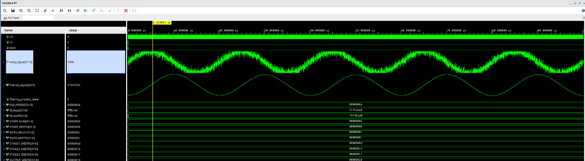
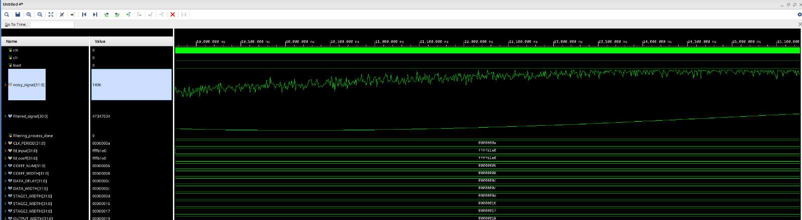

# Symmetric FIR Filter Implementation in Verilog

A highly configurable, pipelined Symmetric FIR (Finite Impulse Response) filter implementation in Verilog HDL. This design leverages symmetry to optimize hardware resources while maintaining high throughput through pipelining.

## Architecture Overview


The filter implements a three-stage pipelined architecture:
1. **Symmetric Pair Addition** - Adds symmetric tap pairs to reduce multiplications
2. **Coefficient Multiplication** - Multiplies summed pairs with filter coefficients
3. **Result Accumulation** - Combines multiplication results for final output

### Key Features

- **Configurable Parameters**
  - Adjustable number of filter taps
  - Configurable data and coefficient widths
  - Automatic bit-width management to prevent overflow

### Directory Structure

```
symmetric_FIR_Verilog_Implementation/
├── src/
│   └── symmetricFIR.v       # Main implementation
├── test/
│   ├── testbench/
│   │   └── symmetricFIR_tb.v
│   ├── generate_noisy_signal.py
│   ├── input_signal.txt
│   └── coeff_val.txt
└── docs/
    ├── behav_sim_example_1.jpeg
    ├── behav_sim_example_2.jpeg
    └── symmetricFIR_block_diagram.jpeg
```

## Simulation Results




## Testing

The testbench provides comprehensive verification:
- Automated coefficient loading from file
- Input signal processing from external source
- Waveform verification capabilities
- Built-in completion detection

### Running Tests

1. Load the design in your preferred Verilog simulator
2. Ensure test vectors are present in:
   - `test/coeff_val.txt` for filter coefficients
   - `test/input_signal.txt` for input samples
3. Run the testbench simulation
4. Monitor filtered output and verification results


## License

[Your chosen license]

## Author

[Your Name]

## Contact

[Your contact information]
