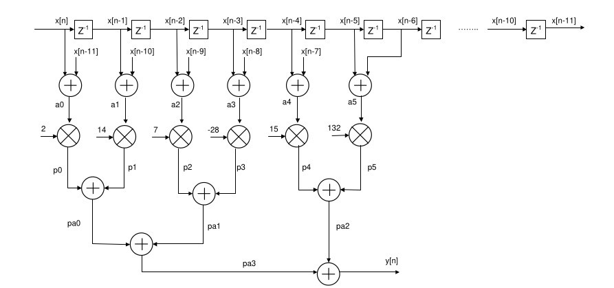
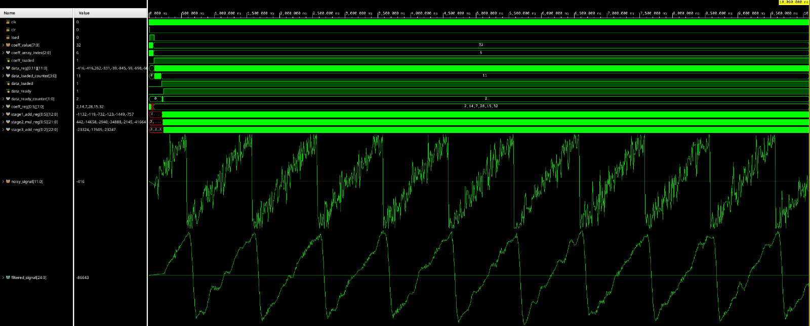
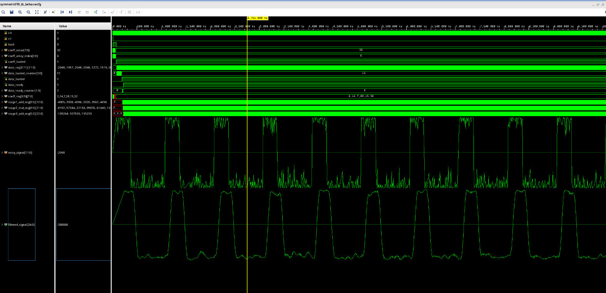
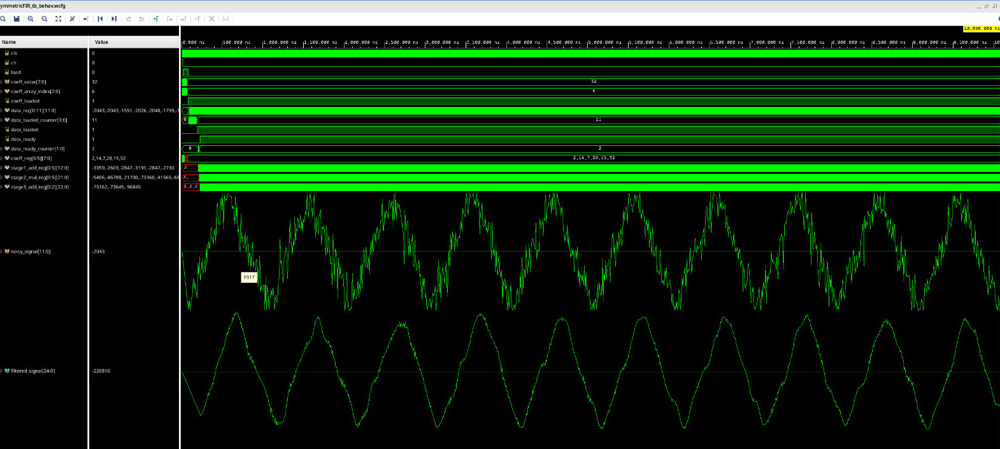
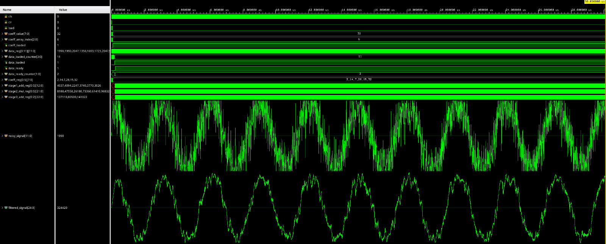

# Symmetric FIR Filter Implementation in Verilog

A pipelined Symmetric FIR (Finite Impulse Response) filter implementation in Verilog HDL. This design leverages symmetry to optimize hardware resources while maintaining high throughput through pipelining.

## Architecture Overview



The filter implements a three-stage pipelined architecture:
1. **Symmetric Pair Addition** - Adds symmetric tap pairs to reduce multiplications
2. **Coefficient Multiplication** - Multiplies summed pairs with filter coefficients
3. **Result Accumulation** - Combines multiplication results for final output

### Key Features

- **Configurable Parameters**
  - Adjustable number of filter taps
  - Configurable data and coefficient widths
  - Automatic bit-width management to prevent overflow
- **Resource Optimization**
  - Exploits coefficient symmetry to reduce multiplications by 50%
  - Pipelined architecture for improved throughput

### Directory Structure

```
symmetric_FIR_Verilog_Implementation/
├── src/
│   └── symmetricFIR.v       # Main implementation
├── test/
│   ├── testbench/
│   │   └── symmetricFIR_tb.v
│   ├── generate_noisy_signal.py
│   ├── input_signal.txt
│   └── coeff_val.txt
└── docs/
    ├── sawtooth.jpeg
    ├── square.jpeg
    ├── triangle.jpeg
    ├── cos.jpeg
    └── symmetricFIR_block_diagram.jpeg
```

## Test Signal Generation

The project includes an interactive Python script (`generate_noisy_signal.py`) for test signal generation. Users can easily configure test signals through command-line prompts.

### Running the Signal Generator

```bash
python generate_noisy_signal.py
```

### Interactive Configuration Options
When you run the script, you'll be prompted to configure:

```python
Configure test signal parameters:
---------------------------------
Sample rate (Hz) [default=1000]: 
Signal frequency (Hz) [default=10]: 
Noise amplitude (0.0-1.0) [default=0.2]: 
Number of samples [default=1000]: 
Signal type [default=sine]: 

Available signal types: 
- 'sine'    : Sinusoidal wave
- 'square'  : Square wave
- 'cos'     : Cosine wave
- 'triangle': Triangle wave
- 'sawtooth': Sawtooth wave
```

### Output
- Generates `input_signal.txt` with hex-formatted signal values
- Displays plot of both clean and noisy signals
- Shows first 10 values in decimal and hexadecimal format for verification

## Simulation Results






## Testing

The testbench provides comprehensive verification:
- Automated coefficient loading from file
- Input signal processing from external source

### Running Tests in Vivado

1. Create New Project in Vivado
2. Add Design Sources:
   - Add `symmetricFIR.v` as design source
   - Add `symmetricFIR_tb.v` as simulation source

3. Add Test Vector Files:
   - Right-click on Simulation Sources → Add Sources
   - Select "Add or create simulation sources"
   - **Important**: Choose "All Files (*.*)" in file type dropdown
   - Add both `coeff_val.txt` and `input_signal.txt`
   > Note: .txt files will only be visible when "All Files (*.*)" is selected

4. Configure Waveform Settings:
   - Start simulation and open waveform window
   - For input signal (`noisy_signal`):
     * Right-click → Waveform Style → Analog
     * Right-click → Radix → Signed Decimal
   - For output signal (`filtered_signal`):
     * Right-click → Waveform Style → Analog
     * Right-click → Radix → Signed Decimal
   > Note: Analog display style allows better visualization of the filtering effect

5. Run Simulation:
   - Start Behavioral Simulation
   - Monitor filtered output and verification results

## License

MIT License

## Author

Yiğit Bektaş Gürsoy

## Contact

- Email: yigitbektasgursoy@gmail.com
